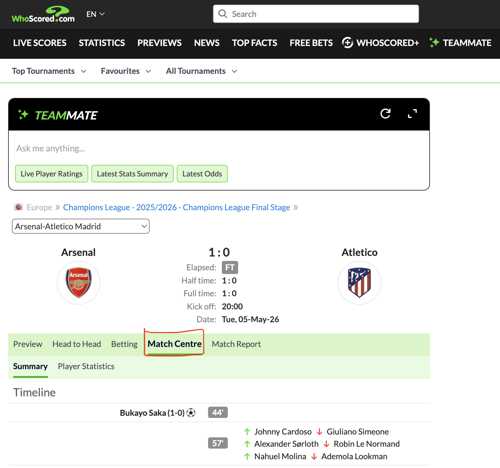

This is a **living document**. It tracks every free, open, or scrape-only event-level data source I have found online. For each source, it shows where to find the data, how to download or scrape it, how its structure works, and how to load it. When I discover something new, I update this page.

## Contents

- [The tiers of event datasets](#the-tiers-of-event-datasets-based-on-accessibility)
- [At a glance](#at-a-glance)
- [StatsBomb](#statsbomb)
- [Wyscout](#wyscout)
- [IMPECT](#impect)
- [SPORTEC](#sportec)
- [WhoScored](#whoscored)
- [PFF](#pff)
- [Tooling](#tooling)
- [Licensing](#licensing)

## What are event datasets?

Event data records every discrete on-the-ball action in a match. A pass, a shot, a duel, and a foul are all events. Each event carries a timestamp, a player, a location on the pitch, and a type. Event data differs from:

- **Match sheet data** — results, lineups, and aggregated stats (shots on target, possession). It can be useful, but it has no per-action detail.
- **Tracking data** — x/y coordinates for every player and the ball at 10–25 Hz. It is the richest data and the rarest to find free.

Event data sits in a good middle ground. It is detailed enough for expected goals (xG), passing networks, pressing stats, and possession chains, etc. It also has an accessibility that tracking data mostly does not have.

## The tiers of event datasets based on accessibility

**1. Fully open** They are free for research, they need no authentication, and they use JSON.

**2. Research-gated** They are usually granted to academic collaborators through institutional agreements. You can ask for them.

**3. Scrape-only** They are rich behind anti-bot protection, they are proprietary, and scraping is almost certainly against ToS.

**4. Commercial** They have high quality, but they are also expensive and licensed.

## At a glance

| Source | Format | Access | License | Events |
|---|---|---|---|---|
| [StatsBomb Open Data](#statsbomb) | JSON | Direct download | Research / non-commercial | ~3.9k matches |
| [Wyscout public](#wyscout) | JSON | Direct download | Open (figshare) | ~3M events, 2017/18 |
| [IMPECT](#impect) | JSON | Direct download | Open (attribution) | Bundesliga 23/24 |
| [SPORTEC](#sportec) | XML (DFL) | Direct download | CC-BY 4.0 | 7 matches (tracking + events) |
| [WhoScored](#whoscored) | JSON (in page) | Scrape | Proprietary, ToS-restricted | ~1.4k per match |
| [PFF FC](#pff) | JSON / JSONL (bz2) | Form request | Free for research | 64 WC games (tracking + events) |

## StatsBomb

[StatsBomb Open Data](https://github.com/hudl/open-data) is the closest thing soccer has to a free, well-documented event dataset. It powers a large share of the tutorials, papers, and blog posts you will read, including my previous [Maradona 1986 analysis](/blog/maradona-1986/maradona-1986) and the [xT grid project](/projects/xtgrid/xtgrid).

### Coverage

One JSON file per match sits under `data/events/`. Lineups and competition metadata sit beside them. Coverage spans FIFA World Cups (1986–2022), Euros, Copa América, AFCON, and club competitions (Champions League, Premier League, La Liga, Serie A). In total, the data covers roughly **3,900 matches**. One limitation is that the data is historical and not the latest.

### License

It is not a standard open-source license. It is a [custom User Agreement](https://github.com/statsbomb/open-data#usage). The data is free for research and non-commercial use. If you publish work that uses the data, you must credit StatsBomb and use their logo per their media pack. They also ask you to register at their resource centre. The license fits blog posts and theses. It does not fit commercial products.

### Structure

Each event has a core set of fields plus a type-specific sub-object:

```json
{
  "id": "4ceb0f7b",
  "period": 2,
  "timestamp": "00:45:31.008",
  "minute": 46,
  "second": 7,
  "type": { "id": 30, "name": "Pass" },
  "possession": 20,
  "team": { "id": 217, "name": "Argentina" },
  "player": { "id": 2358, "name": "Diego Armando Maradona Franco" },
  "position": { "id": 13, "name": "Left Attacking Midfield" },
  "location": [48.2, 39.3],
  "duration": 0.64,
  "related_events": ["6a22f9bb"],
  "pass": {
    "recipient": { "id": 2519, "name": "Jorge Valdano" },
    "length": 7.6,
    "angle": 27.5,
    "height": { "id": 1, "name": "Ground Pass" },
    "end_location": [55.1, 39.2],
    "outcome": { "id": 1, "name": "Complete" }
  }
}
```

Key points:

- **Coordinates** are `[x, y]` on a **0–120 × 0–80** pitch. If you compare with WhoScored's 0–100 coordinates, scale first.
- **Types are human-readable names** (Pass, Shot, Carry, Duel, Interception, Pressure). They are friendlier than WhoScored's numeric IDs, but the taxonomy is broad.
- **Type-specific sub-objects** carry the detail: `pass.length` / `end_location`, `shot.statsbomb_xg` / `freeze_frame`, `carry.end_location`. They are purpose-built objects instead of a generic qualifiers list.
- **Freeze frames** (on shots) give nearby player positions. **360 frames** give all players on screen.

### Loading

The easiest path is [statsbombpy](https://github.com/hudl/statsbombpy), which streams the repo into pandas:

```python
from statsbombpy import sb

df = sb.events(match_id=4407)   # 1986 World Cup final
df.head()
```

For plotting, pair the data with [mplsoccer](https://github.com/andrewRowlinson/mplsoccer):

```python
from mplsoccer import Pitch

pitch = Pitch(pitch_type="statsbomb")
fig, ax = pitch.draw(figsize=(12, 8))
```

You do not need a library. The files are plain JSON on GitHub:

```bash
curl -O https://raw.githubusercontent.com/statsbomb/open-data/master/data/events/4407.json
```

## Wyscout

The [Wyscout public dataset](https://figshare.com/collections/Soccer_match_event_dataset/4415000) is a spatio-temporal event dataset from Luca Pappalardo and colleagues. It was published on figshare (DOI: [10.6084/m9.figshare.c.4415000.v5](https://doi.org/10.6084/m9.figshare.c.4415000.v5)) with a paper in *Scientific Data* ([10.1038/s41597-019-0247-7](https://doi.org/10.1038/s41597-019-0247-7)). The paper is the best reference for the data structure.

### Coverage

The dataset covers seven competitions. They are the top-5 European leagues (La Liga, Serie A, Premier League, Bundesliga, Ligue 1) for the 2017/18 season, the 2018 World Cup (64 matches), and Euro 2016 (51 matches). In total, the data covers 1,941 matches and 3,251,294 events.

### License

The dataset was released openly for research use alongside the paper. The authors ask that you cite the paper and the figshare DOI when you use the data. This dataset powered the [Soccer Data Challenge](http://soccerdatachallenge.di.unipi.it/). Check the current terms on figshare before you publish work that uses it.

### Structure

The dataset ships as JSON files. One file holds competitions, one holds teams, and one holds players. Then each competition has a `matches_<country>.json` file and an `events_<country>.json` file (e.g. `matches_England.json` and `events_England.json`). Events are flat records, not nested like StatsBomb. A pass event looks like this:

```json
{
  "id": 1705123456,
  "eventId": 8,
  "eventName": "Pass",
  "subEventName": "Simple pass",
  "playerId": 3344,
  "teamId": 3161,
  "matchId": 2576335,
  "matchPeriod": "1H",
  "eventSec": 2.4175,
  "tags": [
    { "id": 1801 }
  ],
  "positions": [
    { "x": 49, "y": 50 },
    { "x": 38, "y": 58 }
  ]
}
```

Key points:

- **Seven top-level types** drive the data. They are `pass`, `foul`, `shot`, `duel`, `free kick`, `offside`, and `touch`. The `eventName` field holds the type. The `subEventName` field adds detail (e.g. "Simple pass", "Head pass", "Ground attacking duel", "Save attempt").
- **Coordinates** are `x` and `y` in **0–100**, seen from the attacking team. `x` is the distance toward the opponent's goal. `y` is the distance toward the right side of the pitch. The `positions` array holds two points: the start and the end of the action.
- **Tags encode outcomes** as numeric IDs. Each event has a `tags` array of `{"id": N}` objects. Tag `1801` means the action was accurate. Tag `1802` means not accurate. Tag `1401` marks an interception. The paper's Table 2 lists the full dictionary.
- **`matchPeriod`** is one of `1H`, `2H`, `E1`, `E2`, or `P`. **`eventSec`** is the time in seconds since the start of the period.

### Loading

The easiest path is [socceraction](https://github.com/ML-KULeuven/socceraction)'s `PublicWyscoutLoader`. It downloads the figshare files into a local folder and returns clean dataframes:

```python
from socceraction.data.wyscout import PublicWyscoutLoader

loader = PublicWyscoutLoader(root="wyscout_data", download=True)
competitions = loader.competitions()

england = competitions[competitions["competition_name"].str.contains("England")]
games = loader.games(
    competition_id=england.iloc[0]["competition_id"],
    season_id=england.iloc[0]["season_id"],
)
events = loader.events(game_id=games.iloc[0]["game_id"])
events.head()
```

No library is required for the raw data. The events are plain JSON, so pandas reads them directly:

```python
import pandas as pd

events = pd.read_json("events_England.json")
events.head()
```

Each country file holds several hundred thousand events, so filter to one match before you build anything heavy on it.

## IMPECT

[IMPECT](https://github.com/ImpectAPI/open-data) is a German football analytics provider. It works with the German Football League (DFL). It released open-access event data for the Bundesliga 2023/24 season. The data is more than a raw event stream. It adds IMPECT's own performance KPIs, such as bypassed opponents. Those KPIs do not appear in the other datasets here.

### Coverage

The dataset covers the Bundesliga 2023/24 season. It ships as JSON in a GitHub repository. Separate folders hold match events, event KPIs, player KPIs, lineups and substitutions, match info, player info, and squad info. A `kpi_definitions.json` file explains every KPI.

### Structure

Each match has one events file (e.g. `events_122840.json`). A typical match has roughly 3,000 events. The events are rich. Each event carries the action type, the player, the start and end position, the phase, the body part, and the result. The opening kickoff of a match looks like this:

```json
{
  "id": 4614761966,
  "gameTime": { "gameTime": "00:00.0000", "gameTimeInSec": 0.0 },
  "squadId": 432,
  "player": { "id": 46957, "position": "ATTACKING_MIDFIELD", "positionSide": "CENTRE" },
  "actionType": "KICK_OFF",
  "start": { "coordinates": { "x": 0.0, "y": 0.0 }, "pitchPosition": "MIDDLE_THIRD", "lane": "CENTER" },
  "end": { "coordinates": { "x": -14.8, "y": 3.2 }, "pitchPosition": "MIDDLE_THIRD", "lane": "CENTER" },
  "action": "KICKOFF_WHISTLE",
  "phase": "SET_PIECE",
  "pass": { "distance": 15.1, "angle": 167.8, "receiver": { "playerId": 26476, "type": "TEAMMATE" } },
  "bodyPart": "FOOT",
  "duration": 1.34,
  "opponents": 11,
  "pxT": { "team": 0.005388, "opponent": 0.0004 },
  "distanceToGoal": 52.5,
  "result": "SUCCESS"
}
```

Key points:

- **Coordinates are in meters from the pitch center.** The kickoff starts at `(0, 0)`. The goal line sits at about 52.5 meters. The `adjCoordinates` field mirrors the coordinates on the length axis.
- **The data has around two dozen action types.** Pass, reception, dribble, shot, ground duel, clearance, interception, and block are the most common. Each event also carries `phase` (e.g. open play or set piece) and `bodyPart`.
- **IMPECT adds proprietary KPIs.** The `pxT` field is IMPECT's expected-threat value for the action. It has a team value and an opponent value. A separate file holds one row per event and KPI, around 30,000 rows per match. The `kpi_definitions.json` file explains the 103 KPI definitions, including bypassed opponents.

### Loading

The easiest path is [kloppy](https://github.com/PySport/kloppy), which loads IMPECT's open data into its standard event model (kloppy 3.18 or later):

```python
from kloppy import impect

events = impect.load_open_data(match_id=122840)
df = events.to_df(engine="pandas")
```

No library is required for the raw data. The events are plain JSON, so pandas reads them directly:

```python
import pandas as pd

events = pd.read_json("data/events/events_122840.json")
event_kpis = pd.read_json("data/events_kpis/events_kpis_122840.json")
kpi_definitions = pd.read_json("data/kpi_definitions.json")
```

### License

The data is free to use under IMPECT's terms, which require attribution. No scraping is needed. The files are plain JSON in the repository.

## SPORTEC

[SPORTEC](https://www.nature.com/articles/s41597-025-04505-y) is an integrated dataset of event and tracking data from elite soccer. It was published in *Scientific Data* by Bassek, Rein, Weber, and Memmert (2025). It is one of the few free sources that pairs official event data with full player tracking.

### Coverage

The dataset covers seven matches from the German Bundesliga 2022/23 season. Two are from the first division. Five are from the second division. The first-division matches are 1. FC Köln against FC Bayern München and VfL Bochum against Bayer Leverkusen. The second-division matches are five Fortuna Düsseldorf home games. The dataset covers 207 players, 10 teams, 11,137 events, and 1,002,644 frames of x/y positions.

### Structure

Each match has three XML files in the DFL format. The match information file holds the teams, the players, the pitch size, and the playing time. The events file holds the discrete actions. The position data file holds the raw tracking frames. The tracking comes from TRACAB, the official DFL system, at 25 Hz.

The files follow the DFL naming convention. The match ID `J03WMX` produces these three files:

```
DFL_02_01_matchinformation_DFL-COM-000001_DFL-MAT-J03WMX.xml
DFL_03_02_events_raw_DFL-COM-000001_DFL-MAT-J03WMX.xml
DFL_04_03_positions_raw_observed_DFL-COM-000001_DFL-MAT-J03WMX.xml
```

The competition code is `DFL-COM-000001` for the first division and `DFL-COM-000002` for the second division. The seven match IDs are `J03WMX`, `J03WN1`, `J03WPY`, `J03WOH`, `J03WQQ`, `J03WOY`, and `J03WR9`.

### Loading

The easiest path is [floodlight](https://github.com/floodlight-sports/floodlight)'s `IDSSEDataset`. It downloads the figshare files for a match and parses them. It returns events, positions, possession, ball status, teamsheets, and the pitch:

```python
from floodlight.io.datasets import IDSSEDataset

dataset = IDSSEDataset("J03WMX")
events, xy, possession, ballstatus, teamsheets, pitch = dataset.get("J03WMX")
```

You can also parse the XML files directly with floodlight's DFL parsers:

```python
from floodlight.io.dfl import read_event_data_xml, read_position_data_xml

events, teamsheets, pitch = read_event_data_xml("events.xml", "match_info.xml")
xy, possession, ballstatus, teamsheets, pitch = read_position_data_xml("positions.xml", "match_info.xml")
```

The full dataset is about 2.4 GB. Load all matches with `IDSSEDataset("all")`, or download the files from [figshare](https://doi.org/10.6084/m9.figshare.28196177).

### License

The data is released under CC-BY 4.0, authorized by the DFL (German Football League). No scraping is needed.

## WhoScored

[WhoScored](https://www.whoscored.com) has event data for almost every match in the major competitions. Unlike StatsBomb, the data is *current*. It covers full recent seasons and live matches. The catch is that the data is proprietary. It is licensed from Opta/Stats Perform, it sits behind Cloudflare, and its ToS bans scraping.

The method fits in one line. The match-centre page is a single-page app. All the match data ships inside the HTML so the JavaScript can render it. Bypass Cloudflare, pull the page, extract one JavaScript object literal, and parse it.

If you only need ratings and match stats, use [soccerdata](https://github.com/probberechts/soccerdata)'s maintained WhoScored scraper instead. It does not expose the full event stream, so the manual method below still matters for events.

### Which matches have match centres?

Look at a match list on WhoScored. Every covered match shows a small **Match Centre** link, like the ones in the screenshot below. If a match has that link, you can scrape it.



The link opens the match-centre page. That page is a single-page app, so all its event data sits in the HTML source. Scrape the page, then pull the data out of the source. The steps below show how.

Not every match has the link. Coverage follows the competitions in WhoScored's detailed Opta feed — the top leagues of Europe, UEFA club competitions, major international tournaments, and many domestic leagues worldwide ([their about page](https://www.whoscored.com/aboutus) lists them). I verified this on four matches. A Champions League match, an MLS match, and a Russian Premier League match all expose the full event stream (pages around 1.2 MB). A Belarus Premier League match does not (page around 0.1 MB, summary only). Small domestic leagues and most lower divisions usually have no match centre.

### Step 1: Bypass Cloudflare

A plain `curl` gets a 403 block page. The usual escape hatch is [`cloudscraper`](https://pypi.org/project/cloudscraper/):

```python
import cloudscraper

scraper = cloudscraper.create_scraper(
    browser={'browser': 'chrome', 'platform': 'darwin', 'mobile': False},
)
url = "https://www.whoscored.com/matches/1978405/live/europe-champions-league-2025-2026-arsenal-atletico-madrid"
response = scraper.get(url, timeout=30)
print(response.status_code, len(response.text))   # 200, ~1,300,000
```

### Step 2: Find the data

Search for `matchCentreData`. It lives inside a `require.config.params["args"]` object:

```python
import re
match = re.search(r'require\.config\.params\["args"\]\s*=\s*({.+?});\s*\n', response.text, re.DOTALL)
```

That object is a JS literal (unquoted outer keys, JSON inside). It has `matchId`, `matchCentreData`, `matchCentreEventTypeJson`, and `formationIdNameMappings`. `matchCentreData` holds the `events` array, a `playerIdNameDictionary`, and the full `home`/`away` team objects (players, stats, shot zones, incident events).

### Step 3: Parse the object literal

The pragmatic way to parse a JS object literal is to let JavaScript parse it:

```bash
node -e "const a = require('/tmp/args.js'); console.log(a.matchCentreData.events.length)"
# 1398  events for Arsenal vs Atlético
```

A single event looks like this:

```json
{
  "eventId": 4,
  "minute": 0,
  "second": 2,
  "teamId": 63,
  "playerId": 80764,
  "x": 36.6,
  "y": 49.2,
  "period": { "value": 1, "displayName": "FirstHalf" },
  "type": { "value": 1, "displayName": "Pass" },
  "outcomeType": { "value": 1, "displayName": "Successful" },
  "qualifiers": [
    { "type": { "value": 140, "displayName": "PassEndX" }, "value": "29.7" },
    { "type": { "value": 141, "displayName": "PassEndY" }, "value": "67.0" },
    { "type": { "value": 212, "displayName": "Length" }, "value": "14.1" }
  ],
  "isTouch": true,
  "endX": 29.7,
  "endY": 67
}
```

Field notes: `type.value` resolves to a name via `matchCentreEventTypeJson` (numeric IDs throughout, unlike StatsBomb's named types). `x`/`y` are **0–100**. `qualifiers` carry event-specific detail (pass length/angle/end, shot coordinates, zone). `playerId` resolves via `playerIdNameDictionary`.

### The ethics

Scraping WhoScored is **against its Terms of Service**. The data belongs to a rights holder that pays for the data. The practice stays defensible for personal work under four conditions: a handful of matches, never redistributed, non-commercial, and modest request volume. Avoid publishing raw dumps, scraping at scale, and building anything on the data. If you want data you can publish with, use [StatsBomb](#statsbomb). It is licensed for exactly that.

## PFF

[PFF FC](https://www.blog.fc.pff.com/blog/pff-fc-release-2022-world-cup-data) is the soccer arm of Pro Football Focus. Pro Football Focus started as an American football analytics company. PFF FC released a dataset for the 2022 World Cup. The dataset combines broadcast tracking data, event data, and PFF's play-by-play player grades for all 64 matches.

### Coverage

The dataset covers all 64 matches of the 2022 World Cup. Every match has tracking data, event data, and a play-by-play grade for each player on each action.

### Structure

The tracking data is broadcast tracking from Sportlogiq. Each game has one file named `{game_id}.jsonl.bz2`. The file is a bzip2-compressed JSON-lines file with one frame per line.

The event data sits in the "Event Data" folder, one file per game. The metadata folder holds players, rosters, and competitions. The original release stored all events in one `events.json` file. The enhanced release split the events per game.

The grades follow PFF's grading scale. Each action gets a grade from -2 to +2 in 0.5 steps. The grades convert to a 0-100 scale at the season level.

### Loading

Pandas reads the metadata files directly:

```python
import pandas as pd

players = pd.read_csv("players.csv")
rosters = pd.read_csv("rosters.csv")
competitions = pd.read_csv("competitions.csv")
```

The tracking files are bzip2-compressed JSON lines. Read them with the `bz2` module:

```python
import bz2
import json

with bz2.open("game.jsonl.bz2", "rt") as f:
    frames = [json.loads(line) for line in f]
```

PFF FC also runs a GraphQL API for its data. The [pypff](https://github.com/jackneururer/pypff) client turns the API into pandas dataframes:

```python
from pypff import pff

url = "https://sandbox.faraday.pff.com/api"
key = "your_api_key"

events = pff.get_game_events(url, key, game_id=12345)
```

### Access

The dataset is free, but access requires filling a short form on the PFF FC blog. The data is then shared over Google Drive. No scraping is needed.

## Tooling

Free data is only useful if you can load and process it. The community has built open tools that do this well:

- **[kloppy](https://github.com/PySport/kloppy)** loads event and tracking data from many providers into standardized formats.
- **[statsbombpy](https://github.com/hudl/statsbombpy)** / **StatsBombR** are official clients for StatsBomb data.
- **[socceraction](https://github.com/ML-KULeuven/socceraction)** converts raw events to **SPADL** (the standard action representation) and implements xT / VAEP valuation.
- **[mplsoccer](https://github.com/andrewRowlinson/mplsoccer)** is widely used for drawing pitches and visualizing events.
- **[floodlight](https://github.com/floodlight-sports/floodlight)** is a NumPy/Pandas package for sports data analysis.
- **[soccerdata](https://github.com/probberechts/soccerdata)** is a collection of scrapers by Pieter Robberechts. It loads data from FBref, Understat, Sofascore, ESPN, and WhoScored into consistent pandas dataframes and caches locally. Many of those sources are scrape-only, so use it with care.

The [KU Leuven ECML/PKDD 2024 tutorial on team sports analytics](https://dtai.cs.kuleuven.be/tutorials/sports/ecml2024/notes/datasets/soccer/) collects a good part of this landscape. It is worth bookmarking.

## Licensing

Free access does not equal free use. Keep three things in mind:

- **StatsBomb open data** allows research and non-commercial use. It also requires attribution and registration.
- **Scraped data** is almost certainly a ToS violation, even if the data is "publicly visible." It is fine for personal learning. It is not fine to publish or ship.
- **None of the free event data** allows building a commercial product without a license.

My recommendation: use the open datasets for anything I might publish. Keep scrape-only sources for personal experiments that never get redistributed.

Last updated: August 9, 2026
